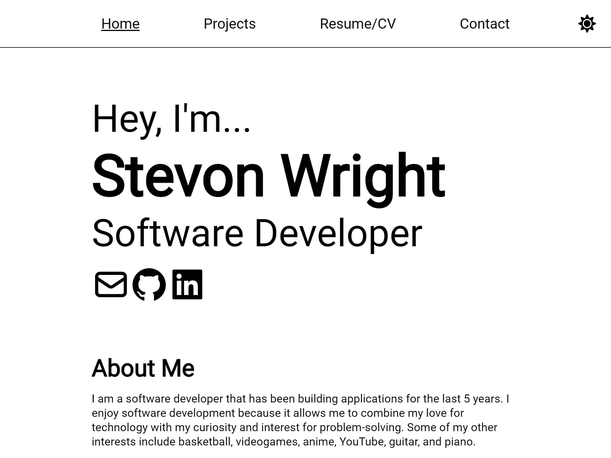

# Portfolio Site

This is my software development portfolio.

## Tech Stack

-   HTML (actually JSX)
-   SASS
-   Javascript (React, Gatsby)

## How to Run

### Live App

Simply visit [https://stevon.devp](https://stevon.dev) to view this website.

### From Source

If you don't feel as though using the live website is enough for you, you can run my website from the source code in this respository with these steps:
**Note: Must have Node JS installed**

1. Open command line or terminal
2. Clone the repository with `git clone https://github.com/TeenageMutantCoder/portfolio-site`
3. Move into the directory with `cd portfolio-site`
4. Run `npm install` or `yarn install` (if you don't have yarn installed, you can install it first using `npm install --global yarn`).
5. Run `npm run start` or `yarn run start`. Alternatively, you can run the production build with `npm run build && npm run serve` or `yarn run build && yarn run serve`.
